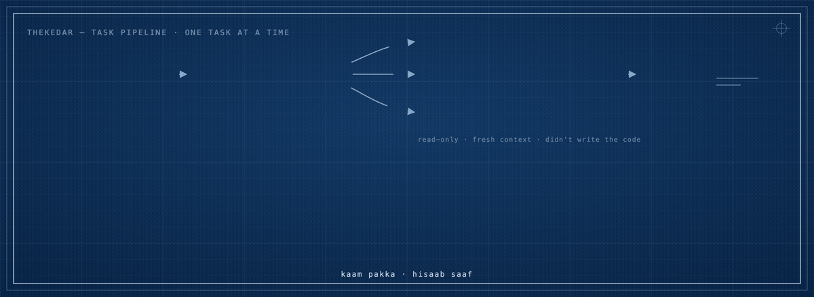
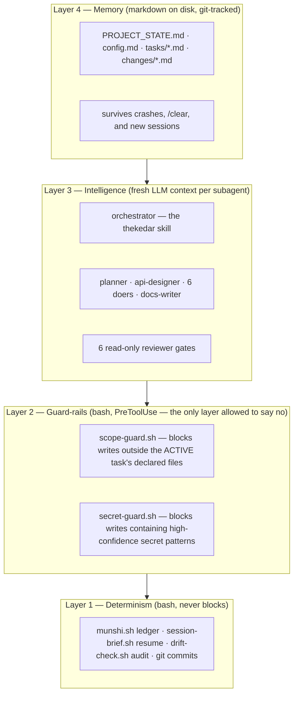
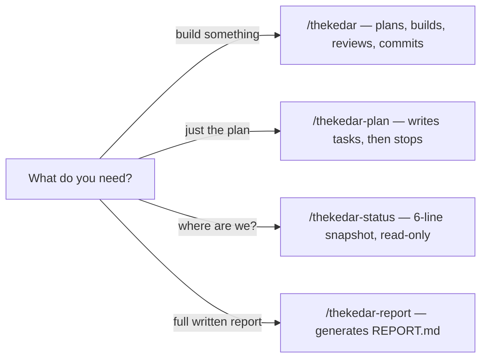
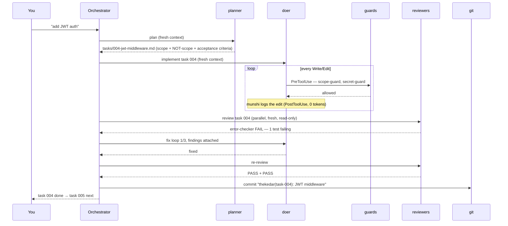

<p align="center">
  
</p>

[](https://github.com/soumyachk101/Thekedar/actions/workflows/ci.yml)
[](https://github.com/soumyachk101/Thekedar/actions/workflows/shellcheck.yml)
[](LICENSE)


> **Your AI coding crew's site supervisor.** Breaks big projects into small tasks, assigns specialist agents, gates every task behind independent review, mechanically enforces scope, and keeps a written record of every change — so your AI never hallucinates its way through your codebase again.

*Thekedar (Hindi: ठेकेदार) — the contractor on an Indian construction site. He doesn't lay bricks himself. He splits the work, assigns the right worker to the right job, inspects everything before sign-off, and the munshi (clerk) writes it all down.*

**That's exactly what this does to your AI coding agent.**

---

## See it work

<p align="center">
  
</p>

One task, start to finish: a doer implements it, two guard-rail hooks check every single file write as it happens, independent reviewers approve it in fresh contexts, munshi logs it, and it gets committed. Then the next task starts. No step is skipped, and nothing above is simulated — it's the real pipeline, described below turn by turn.

---

## The Problem

AI coding agents are brilliant for 20 minutes, then:

1. **Context bloat → hallucination.** Give an agent a whole codebase and a vague goal, and by turn 40 it's confidently editing files that don't exist.
2. **No paper trail.** "What did the AI change yesterday?" Nobody knows. Git diff shows *what*, never *why* or *what was deliberately left alone*.
3. **One agent, every hat.** The same context window writes backend code, reviews its own security, and checks its own UI. It grades its own homework. It gives itself an A.
4. **Session dies, knowledge dies.** Crash, `/clear`, or a new day — and the agent restarts from zero.
5. **Prompting isn't enforcement.** "Don't touch that file" is a request, not a wall — and under context pressure, a request is exactly what gets forgotten first.

## The Fix

Thekedar installs a **workflow discipline** on top of Claude Code (and other agents via a generated `AGENTS.md`), built as four layers. The rule that shapes all four: **push work down the stack** — if bash can enforce something, don't spend tokens asking an LLM nicely; if one small, scoped context can do a job, don't hand it to the big polluted one.



Layer 2 is the headline addition in v2: v1 could only log what happened (Layer 1) and hope the prompt held (Layer 3). Layer 2 can say **no**, mechanically, *before* a write lands — closing problem P5 above. Every edit is logged. Every scope violation is blocked before it happens, not caught after. Every task is documented. Every change is reviewed by an agent that **didn't write it**.

## The Crew — 15 agents, 5 hooks, 4 skills

Every agent runs in its own fresh context — it never sees the conversation that led to it being invoked, only its own system prompt and the task file. Reviewers additionally have no `Write`/`Edit` tool at all — "read-only" is enforced by Claude Code's runtime, not a promise in a prompt.

### Core crew — always installed

| Agent | Nickname | Fires when | Tools | Model |
|---|---|---|---|---|
| `planner` | नक्शा-वाला — naksha-wala, the blueprint-maker | Start of any multi-step build / feature / refactor request | Read, Grep, Glob, Write | inherit |
| `backend-dev` | मिस्त्री — mistri, the mason | Backend, API, database, or script task | Read, Write, Edit, Bash, Grep, Glob | sonnet |
| `frontend-dev` | रंग-मिस्त्री — rang-mistri, the finishing mason | UI, component, or style task | Read, Write, Edit, Bash, Grep, Glob | sonnet |
| `error-checker` | The inspector | Every task, always — read-only | Read, Bash, Grep, Glob | sonnet |
| `security-auditor` | चौकीदार — chowkidar, the guard | Every task, always — read-only | Read, Grep, Glob, Bash | sonnet |
| `frontend-reviewer` | The finisher | Whenever UI files were touched — read-only | Read, Grep, Glob, Bash | sonnet |

### Extended crew — `install.sh --full`

| Agent | Nickname | Fires when | Tools | Model |
|---|---|---|---|---|
| `api-designer` | The doorframe-drawer | Task creates/changes an API surface — writes the contract *before* backend-dev builds it | Read, Grep, Glob, Write | inherit |
| `db-specialist` | The foundations engineer | Schema, migration, or query-layer task | Read, Write, Edit, Bash, Grep, Glob | sonnet |
| `devops-engineer` | The site-services engineer | Docker, CI/CD, env config, or deploy task | Read, Write, Edit, Bash, Grep, Glob | sonnet |
| `test-writer` | The proof-writer | Test-gap task, or behavior-lock tests before any refactor | Read, Write, Edit, Bash, Grep, Glob | sonnet |
| `refactor-specialist` | The renovation specialist | Refactor task — refuses to start without test-writer's lock tests | Read, Write, Edit, Bash, Grep, Glob | sonnet |
| `docs-writer` | The munshi's cousin | Documentation task — sources are changelogs and code, never memory | Read, Write, Grep, Glob | haiku |
| `dependency-auditor` | The gate-register clerk | Diff touches a dependency manifest or lockfile — read-only | Read, Grep, Glob, Bash | haiku |
| `performance-auditor` | The load-inspector | `enable_performance_auditor: true`, or task tagged `perf` — read-only | Read, Grep, Glob, Bash | sonnet |
| `accessibility-auditor` | The accessibility inspector | `enable_accessibility_auditor: true`, or task tagged `a11y` — read-only | Read, Grep, Glob, Bash | sonnet |

### Plus 5 hooks and 4 skills

| Hook | Fires on | Can it block? | What it does |
|---|---|---|---|
| `session-brief.sh` | `SessionStart` | No — always exits 0 | Auto-injects `PROJECT_STATE.md` + the active task + the latest changelog into the fresh session, before you type anything |
| `scope-guard.sh` | `PreToolUse` (Write\|Edit\|MultiEdit) | **Yes** — exit 2 on a confirmed miss | Blocks writes outside the ACTIVE task's declared `## Expected files` / `## Scope addition` |
| `secret-guard.sh` | `PreToolUse` (Write\|Edit\|MultiEdit) | **Yes** — exit 2 on a confirmed match | Blocks writes whose new content matches a high-confidence secret pattern (AWS, PEM, JWT, GitHub, Slack, Stripe, Anthropic, Google) |
| `munshi.sh` | `PostToolUse` (Write\|Edit\|MultiEdit) | No — always exits 0 | Appends one `\| time \| tool \| file \|` row to today's ledger. Zero tokens, zero opinions |
| `drift-check.sh` | called by the orchestrator at task end | No — reports, never gates | Diffs `git status` against the task's declared scope; its one-line verdict is copied into the changelog |

| Skill | Use it when |
|---|---|
| `thekedar` | You want it planned **and** built — the full plan → build → review → log loop |
| `thekedar-plan` | You want the task breakdown only — it writes tasks and hard-stops before building anything |
| `thekedar-status` | You want a 6-line "where are we" snapshot — read-only, spawns nothing |
| `thekedar-report` | You want a full written report of everything done so far |



## Install

**As a Claude Code plugin** (nothing lands in your repo; auto-updates; `.thekedar/` scaffolding is created on first session):

```bash
claude plugin marketplace add soumyachk101/Thekedar
claude plugin install thekedar@thekedar
```

**Or via the script** (commits `.claude/` + `.thekedar/` into your repo — best for teams):

```bash
# core crew — 6 agents (planner, backend-dev, frontend-dev, error-checker, security-auditor, frontend-reviewer)
git clone https://github.com/soumyachk101/Thekedar /tmp/thekedar && bash /tmp/thekedar/install.sh

# full crew — the 9 extended specialists too (test-writer, db-specialist, devops-engineer, ...)
bash /tmp/thekedar/install.sh --full

# health check, anytime
bash .thekedar/scripts/doctor.sh
```

Pick one path (running both against one project can double-wire hooks). Full comparison + manual install: [INSTALL.md](INSTALL.md). The installer is idempotent (safe to re-run, including after `update.sh`), backs up any file it would overwrite to `<file>.bak`, and never touches `PROJECT_STATE.md` or `config.md` once they exist.

**Requirements:** Claude Code ≥ 2.x, `bash`, `git`. `jq` or `python3` recommended — hooks degrade gracefully without either, and `secret-guard.sh` specifically fails open (allows the write, scans nothing) if neither is present, rather than risk a false block. Zero npm/pip dependencies, ever — see [ADR-0001](docs/adr/0001-markdown-as-the-interface.md).

## Quick Start

```
you: Build me a todo app with a REST API

thekedar skill activates →
  planner writes:
    .thekedar/tasks/001-project-setup.md
    .thekedar/tasks/002-db-schema.md
    .thekedar/tasks/003-todo-crud-api.md   ← api-designer writes the API contract first
    ...
  backend-dev picks up 001 → implements →
    every Write/Edit passes scope-guard + secret-guard, munshi logs it
  error-checker: ✅ PASS  security-auditor: ✅ PASS →
  drift-check: none → changelog written → git commit "thekedar(task-001): ..." →
  next task.
```

Resume anytime, even in a fresh session — `session-brief.sh` briefs it before you type a word:

```
you: continue the project
claude: [session-brief auto-injected PROJECT_STATE.md]
        Tasks 001–003 done. Resuming 004-todo-list-ui...
```

Here's what actually happens inside one task, turn by turn:



That FAIL-then-fix-loop isn't hypothetical — it's exactly what happened in the real worked example below.

## See a Real Run

[`examples/demo-todo-app/`](examples/demo-todo-app/) isn't a template — it's the actual `.thekedar/` output from Thekedar building a small Express + SQLite todo app, start to finish, over 6 real tasks. Three things in it are worth looking at directly, because they're the parts marketing copy usually hides:

**1. The scope fence actually held.** Task 002 (db schema) declares in its own file:

```
## NOT in scope (the fence — do not cross)
- HTTP routes (task 003 — this task has no /api surface at all)
- server.js — do NOT wire this into the running app yet, that's 003's job
```

The schema task doesn't get to "helpfully" wire itself into the running app. That's `scope-guard.sh` enforcing exactly what it says on the tin.

**2. The fix loop is shown, not hidden.** Task 003's changelog records a real `error-checker` catch:

> `error-checker`: **FAIL → PASS after 1 fix loop** — first pass: `[CRITICAL] routes/todos.js:14 — POST accepts a whitespace-only title ("   ") as valid because .length check runs before trimming — creates blank-looking todos`. backend-dev added `.trim()` ahead of the length check; re-review: all 5 acceptance criteria verified, PASS.

**3. Known issues carry forward instead of vanishing.** `PROJECT_STATE.md`'s Known Issues section still lists: *"No rate limiting on `POST /api/todos` — flagged INFO by security-auditor in task-003, acceptable for a local single-user demo, would need addressing before any real deployment."* It didn't block the task, so it wasn't fixed — but it also wasn't silently dropped.

Want the mechanics spelled out even further — every hook call, every guard check — for a bigger feature? [docs/WORKFLOW.md](docs/WORKFLOW.md) walks a comparable password-reset feature end to end.

## The Guard-Rail Layer

This is the part that's actually new in v2, so it's worth explaining plainly instead of just diagramming it.

While a task is `ACTIVE`, every single `Write`/`Edit`/`MultiEdit` call — from any doer, on any file — is intercepted *before* it executes:

1. **`scope-guard.sh`** checks the target path (canonicalized, so `src/../outside/x` can't sneak past a `src/*` allowlist entry) against the ACTIVE task's declared `## Expected files` and any `## Scope addition` entries. A miss gets rejected with:
   > `SCOPE-GUARD: <path> is outside task NNN's declared files. Either add a "## Scope addition" entry (file + one-line reason) to the task file first, or leave this file alone.`

   The doer's real option, and the intended path for legitimate scope growth, is to add that `## Scope addition` entry and retry — not to fight the guard.

2. **`secret-guard.sh`** scans only the *new* content about to be written (never the whole file, never `old_string`) for nine high-confidence secret patterns — AWS keys, PEM private key blocks, JWTs, GitHub/Slack/Stripe/Anthropic/Google tokens. A hit blocks and names the matched pattern type directly, then tells the doer to use an environment variable instead.

Both guards share one non-negotiable property: **fail open.** A parse error, a missing `jq`/`python3`, no `ACTIVE` task, an unreadable task file — any of these lets the write through. The *only* path to a block is a positive, confirmed match. A bug in these hooks costs you one uncaught edit, never a bricked session — see [ADR-0002](docs/adr/0002-hooks-never-block-except-guards.md) and [ADR-0006](docs/adr/0006-scope-guard-as-pretooluse.md).

## What Gets Written to Disk

```
your-project/
├── .thekedar/
│   ├── PROJECT_STATE.md       ← resume-anywhere memory
│   ├── config.md              ← fix_loop_cap, auto_continue, scope_guard, ...
│   ├── tasks/
│   │   ├── 001-setup.md       ← scope, NOT-scope, acceptance criteria
│   │   └── 002-auth.md
│   ├── changes/
│   │   ├── ledger-2026-07-09.md   ← munshi's per-edit log (automatic)
│   │   └── task-001.md            ← rich per-task changelog
│   ├── templates/              ← 7 templates, copied in at install
│   └── scripts/                ← doctor.sh, report.sh, stats.sh, export-agents-md.sh, new-agent.sh
└── .claude/
    ├── agents/
    │   ├── core/                ← 6 always-installed agents
    │   └── extended/            ← 9 more with --full
    ├── skills/                  ← thekedar, thekedar-plan, thekedar-report, thekedar-status
    ├── hooks/                   ← the 5 hook scripts above
    └── settings.json            ← hook wiring, merged in — never blindly overwritten
```

## Honest Notes (padh lo, zaroori hai)

- **Token cost is real.** Estimate 2–4× a raw single-session request for orchestrated work — a planner pass up front, then per task roughly one doer + 2 always-on gates (error-checker, security-auditor) + conditional gates when relevant. No hard numbers are published yet; [BENCHMARKS.md](docs/BENCHMARKS.md) has the methodology, honestly labeled "no runs completed yet." For a throwaway script, don't use Thekedar — the orchestrator's own first rule is triaging trivial requests straight through, no ceremony.
- **Munshi and the guards are deterministic, not smart.** They log and block on pattern matches, for free. The *reasoning* — the changelog, the scope judgment calls — is written by the orchestrator, once, at task boundaries.
- **Reviewers can be wrong.** They cut the slip-through rate a lot; they don't replace your eyes on a final PR.
- **Two sessions on one project isn't safe yet.** State and task files can race if you run Thekedar concurrently against the same repo — see [TROUBLESHOOTING.md](docs/TROUBLESHOOTING.md).
- **No subagent isolation in your tool?** `export-agents-md.sh` flattens the whole crew into a single `AGENTS.md` for Cursor/Codex CLI/Copilot/Windsurf. It's honestly weaker there — the "reviewer" shares the doer's context and blind spots — but it still beats no review at all.

## How Thekedar Compares

**vs. raw Claude Code** — the most direct comparison, and where the case is clearest:

| | Raw Claude Code | + Thekedar |
|---|---|---|
| Planning | Ad hoc, in-conversation | Written task files, scoped, before code exists |
| Scope control | Whatever the prompt says | Mechanically enforced — `scope-guard.sh` blocks at write-time |
| Review | You, or asking the same context to "check its work" | Independent subagent, fresh context, never saw the implementation reasoning |
| Audit trail | `git log` messages, whatever you happened to write | Automatic ledger (every edit) + per-task changelog (what/why/what-NOT) |
| Resume | Re-explain state each session | `session-brief.sh` auto-injects `PROJECT_STATE.md` at session start |
| Token cost | Baseline | 2–4× |

*"Thekedar is strictly more expensive for anything genuinely small — that's why the orchestrator's own first rule is triaging trivial requests straight through, no ceremony."*

**vs. OpenSpec / spec-kit** — real philosophical overlap (write down what you're building before you build it); Thekedar adds mechanical enforcement of scope and automatic written records on top of the same planning idea. If you only want the spec artifact and plan to implement by hand, the full crew-plus-gates is more machinery than you need.

**vs. claude-flow and similar orchestration frameworks** — the honest bet, stated plainly: *"boring and durable beats clever and fragile for something you're trusting with unattended multi-hour edits."* Zero runtime dependencies (bash + git) instead of an npm/pip tree and often a database or daemon — at the cost of whatever features a heavier framework offers (dashboards, complex agent topologies).

Full writeup with all three comparisons in detail, plus a fourth against manual code review of AI output: [docs/COMPARISON.md](docs/COMPARISON.md).

## FAQ

**What does this actually cost in tokens?**
2–4× a raw single-session request for orchestrated work. Reviewers fire once per task, not per edit — that's the single biggest cost control.

**When should I *not* use this?**
Throwaway scripts, one-off queries, single-file tweaks, exploratory work where you're still figuring out what you even want, tiny personal projects you'll never revisit.

**Does scope-guard mean the AI literally cannot go rogue?**
It means the AI cannot *silently* touch a file outside the current task's declared scope. It doesn't stop a determined agent from adding a bogus `## Scope addition` entry and editing anyway — it closes the "oops, forgot the fence was just text" failure mode, not the "the model actively decided to lie about its reason" one.

**Why markdown and bash instead of a real database or daemon?**
Durability and inspectability. A markdown file survives every tool migration and every Claude Code version bump, and opens in literally anything. A daemon is one more thing to keep running, one more thing to debug when it silently dies.

More, including the `jq`/`python3` fallback behavior and using a language Thekedar has no dedicated specialist for: [docs/FAQ.md](docs/FAQ.md).

## Docs

**Using it**
[Commands](docs/COMMANDS.md) · [Customization](docs/CUSTOMIZATION.md) · [Troubleshooting](docs/TROUBLESHOOTING.md) · [FAQ](docs/FAQ.md)

**Understanding it**
[Architecture](docs/ARCHITECTURE.md) · [Workflow walkthrough](docs/WORKFLOW.md) · [Agents guide](docs/AGENTS-GUIDE.md) · [Hooks guide](docs/HOOKS-GUIDE.md) · [Factory (catalog-driven crew)](docs/FACTORY.md) · [Comparison](docs/COMPARISON.md)

**Why it's built this way**
[PRD](docs/PRD.md) · [TRD](docs/TRD.md) · [Benchmarks](docs/BENCHMARKS.md) · [Design decisions (7 ADRs)](docs/adr/)

**Project**
[Install guide](INSTALL.md) · [Roadmap](ROADMAP.md) · [Contributing](CONTRIBUTING.md) · [Changelog](CHANGELOG.md) · [Security policy](SECURITY.md) · [Code of Conduct](CODE_OF_CONDUCT.md)

## Inspired By

- [caveman](https://github.com/JuliusBrussee/caveman) — proof that a personality + one sharp idea + zero deps = a great agent tool
- Spec-driven development (OpenSpec, spec-kit) — small scoped specs beat big vague prompts
- Every thekedar on every Indian construction site who never let bad work pass 🫡

## License

MIT — see [LICENSE](LICENSE).

---

*Kaam pakka, hisaab saaf.* (Solid work, clean records.)
